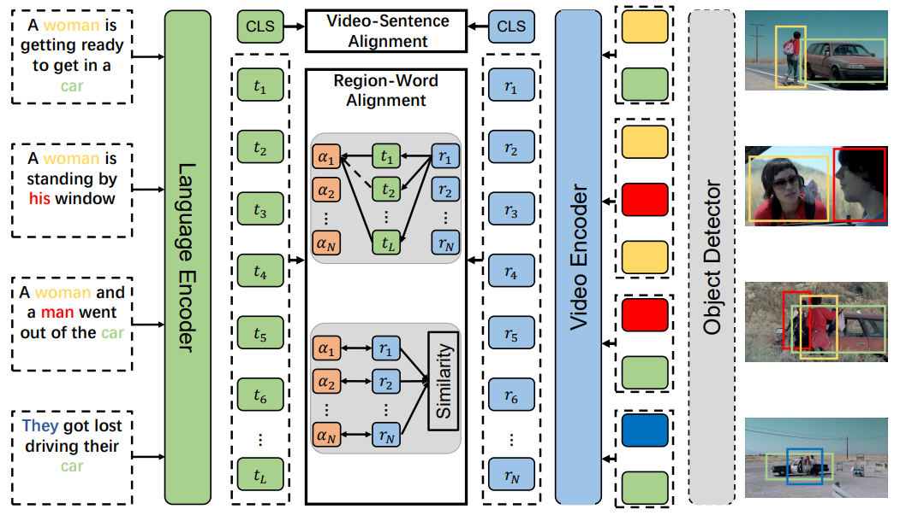

# DemoVLP
## Revitalize Region Feature for Democratizing Video-Language Pre-training  
Guanyu Cai, Yixiao Ge, Alex Jinpeng Wang, Rui Yan, Xudong Lin, Ying Shan, Lianghua He, Xiaohu Qie, Jianping Wu, Mike Zheng Shou [[Arxiv]][1]  

Pytorch implementation of our method for video-language pre-training.  



## Requirement
```
conda create -n demovlp python=3.8
source activate demovlp 
pip install -r requirements
```

## Pre-trained weights
|Model|Dataset|Download|
|-----|-------|--------|
|DemoVLP|WebVid+CC3M|[Model][7]|
|DemoVLP|WebVid+CC3M+CC7M|[Model][8]|

## Data
### Download Pre-trained model
- ViT checkpoint
```
mkdir pretrained
cd pretrained
wget -c https://github.com/rwightman/pytorch-image-models/releases/download/v0.1-vitjx/jx_vit_base_p16_224-80ecf9dd.pth
```
- distilbert-base-uncased  
```
cd pretrained
mkdir distilbert-base-uncased
```
Download all files from huggingface [distilbert-base-uncased][2], and put them into `pretrained/distilbert-base-uncased`  

### Pre-train datasets
- WebVid  
Refer to Gihub repo [WebVid](https://github.com/m-bain/webvid).

- CC3M  
Refer to [Conceptual Captions Website](https://ai.google.com/research/ConceptualCaptions/download).

> Note: `meta_data/webvid_validation_success_full.tsv` and `meta_data/cc3m_validation_success_full.tsv` are used to load videos and captions. The train split are also organized in the same way. Due to the file size of train split metadata files (e.g., `meta_data/webvid_validation_success_full.tsv`, `meta_data/cc3m_validation_success_full.tsv`) is too large, we didn't give them in this repo.   

### Downstream datasets
- MSRVTT
```
wget https://www.robots.ox.ac.uk/~maxbain/frozen-in-time/data/MSRVTT.zip
```

- MSVD
```
wget -c https://www.cs.utexas.edu/users/ml/clamp/videoDescription/YouTubeClips.tar
```
Please refer to [MSVD](https://www.cs.utexas.edu/users/ml/clamp/videoDescription/) for more details if you have difficult in downloading this dataset.

- DiDeMo  
Please refer to [ClipBERT](https://github.com/jayleicn/ClipBERT/blob/main/scripts/download_didemo.sh) for details.

- LSMDC  
Download source video from [Website](https://sites.google.com/site/describingmovies/).


- TGIF  
Download raw frames from [Google Driver][9].

### Extract region feature
We adopt [bottom-up-attention][6] to extract region features for all datasets.  
To save time and storage consumption, we uniformly sample 8 frames for each video in WebVid and extract region features for each frame.  

To help organize all these dataset, we give a snapshot of how we structure these data folders as follows:
- WebVid  
```
|--WebVid
|----train
|--------000001_000050
|------------1066674784.mp4
|------------...
|------------1066724161.mp4
|--------...
|--------199951_200000
|----val
|----region_features_all
|--------train
|------------000001_000050
|----------------1066674784
|--------------------1.npz
|--------------------...
|--------------------8.npz
|------------...
|--------val
```
Other data folders of downstream tasks are structured in a similar way to WebVid.  

- CC3M
```
|--CC3M
|----training
|----validataion
|--------0_1595581236
|--------...
|--------9999_352904708
|----region_features_all
|--------train
|--------val
|------------0000
|----------------0_1595581236_1.npz
|----------------...
|----------------998_856795266_1.npz
|------------0015
```

## Pre-train
Specify `data_dir` and `object_dir` in the config file to directories that contain raw videos and region features.   
```
python -m torch.distributed.launch --nproc_per_node 8 --master_port 2912 train_dist_multi.py --config configs/pt/o2t-cl-local-select-loss-cc.json -sc 30 40
```

> Note: If you use clusters to run a distributed training, please be careful to set environment variables (e.g., master_port, master_address, world_size, rank). In our experiment, we usually use 4 nodes (i.e., 32 GPUs) to conduct the pre-training.

## Downstream tasks
Specify `data_dir` and `object_dir` in the config file to directories that contain raw videos and region features.  
Specify `load_checkpoint` to the pre-trained checkpoint file.  
- MSRVTT Retrieval
```
python -m torch.distributed.launch --nproc_per_node 2 --master_port 2912 train_dist_multi.py --config configs/ft/msrvtt_o2t-select.json -sc 2 4 8
```

- DiDeMo Retrieval
```
python -m torch.distributed.launch --nproc_per_node 2 --master_port 2912 train_dist_multi.py --config configs/ft/didemo_o2t-select.json -sc 2 4 8
```

- MSVD Retrieval
```
python -m torch.distributed.launch --nproc_per_node 2 --master_port 2912 train_dist_multi.py --config configs/ft/msvd_o2t-select.json -sc 2 4 8
```

- LSMDC Retrieval
```
python -m torch.distributed.launch --nproc_per_node 2 --master_port 2912 train_dist_multi.py --config configs/ft/lsmdc_o2t-select.json -sc 2 4 8
```

- MSRVTT QA
```
python -m torch.distributed.launch --nproc_per_node 1 --master_port 2912 train_dist_multi_qa.py --config configs/ft/msrvtt_qa-select.json -sc 2 4 8
```

- MSVD QA
```
python -m torch.distributed.launch --nproc_per_node 1 --master_port 2912 train_dist_multi_qa.py --config configs/ft/msvd_qa-select.json -sc 2 4 8
```

- TGIF-Frame QA
```
python -m torch.distributed.launch --nproc_per_node 1 --master_port 2912 train_dist_multi_qa.py --config configs/ft/tgif_qa-frame-select.json -sc 2 4 8
```

- MSRVTT Multiple Choice
```
python -m torch.distributed.launch --nproc_per_node 2 --master_port 2912 train_dist_multi_mc.py --config configs/ft/msrvtt_mc-select.json 
```
> Note: We directly use the model finetuned on MSRVTT Retrieval.

## Citation
If you find this repository useful, please give it a star and cite as follows :
```
@article{cai2022revitalize,
  title={Revitalize Region Feature for Democratizing Video-Language Pre-training},
  author={Guanyu Cai, Yixiao Ge, Alex Jinpeng Wang, Rui Yan, Xudong Lin, Ying Shan, Lianghua He, Xiaohu Qie, Jianping Wu, Mike Zheng Shou},
  journal={arXiv preprint arXiv:2203.07720},
  year={2022}
}
```

## Acknowledgement
This repo was borrowed from:  
[Frozen-in-time][3]  
[SCAN][4]  
[BFAN][5]  

[1]: https://arxiv.org/abs/2203.07720
[2]: https://huggingface.co/distilbert-base-uncased/tree/main
[3]: https://github.com/m-bain/frozen-in-time
[4]: https://github.com/kuanghuei/SCAN
[5]: https://github.com/CrossmodalGroup/BFAN
[6]: https://github.com/MILVLG/bottom-up-attention.pytorch
[7]: https://mega.nz/file/Yi4igDib#e8M5mwFEYXkGMv9nye9aoDoYr2neTwKx_DZyy6f1qyQ
[8]: https://mega.nz/file/ZiQSkRJb#CmoyCQKePbynJh1uKQT5I0iQ91ZTkQzJO4ecYlAyDuE
[9]: https://drive.google.com/file/d/11wdvsTYIPcSTRMVry1tufILiNE4aAMp5/view?usp=sharing